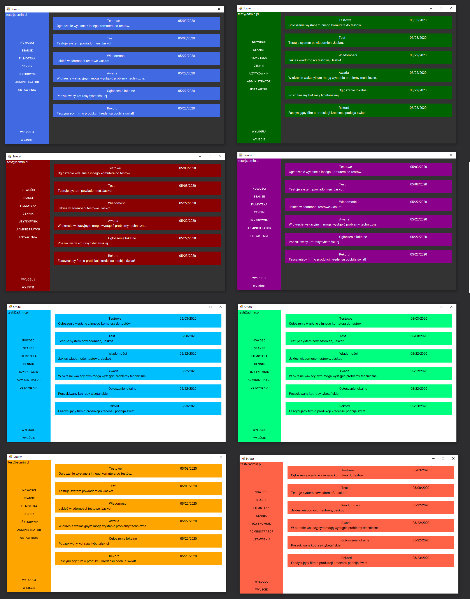

# DesktopApp

This is a desktop application for ,,SCRUTER" system. The application is created with the dedication for windows 10 operating systems.

### Main view

## Technologies

.Net and WinForms

## Application components

### 8 colors version

### Loading bar

Before starting the application, a progress bar is launched indicating the progress of downloading data from the server.

### Notifications

A special notification system informs the user about errors or success during data transfer between the application and the server.

### Autosave

At each login, user can save login data on a local device, so that the next time the application will be automatically logged in.

Graphic settings are also saved.

## Project
The project was created as part of laboratory classes at the State University of Applied Sciences in Legnica.